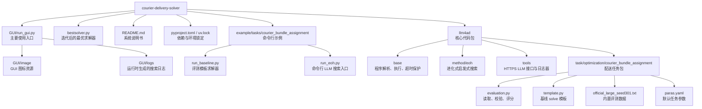
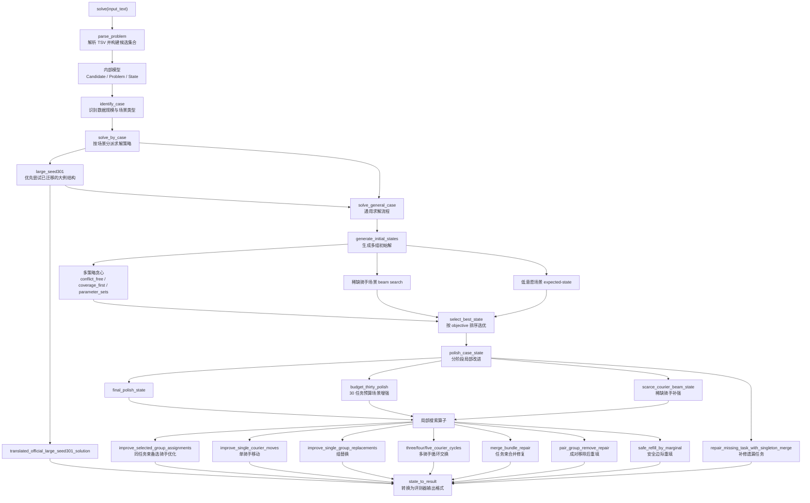

# 外卖配送求解系统说明书

这是一个用于外卖配送任务束分配的求解与评测系统。项目默认推荐通过 GUI 使用，同时保留命令行评测、最优求解器复现和 LLM 搜索入口。

具体题面、目标函数和合法性规则维护在 `llm4ad/task/optimization/courier_bundle_assignment/template.py` 与 `evaluation.py` 中；README 只说明系统如何安装、运行、扩展和验证。

## 系统能力

- 通过 GUI 配置 LLM、搜索方法和配送评测任务
- 运行 `solve(input_text)` 求解器并校验输出合法性
- 计算 objective 与 fitness，并在 GUI 中展示搜索过程
- 提供迭代后的最优求解器 `bestsolver.py`
- 提供命令行脚本用于快速评测和回归验证
- 使用 `uv` 管理 Python 环境与依赖锁文件

## 安装依赖

克隆仓库：

```bash
git clone https://github.com/tltltltltltltltl/courier-delivery-solver.git
cd courier-delivery-solver
```

安装 Python 依赖：

```bash
uv sync
```

项目依赖写在 `pyproject.toml`，主要包括：

- `numpy<2`
- `matplotlib`
- `ttkbootstrap`
- `pyyaml`
- `pytz`

GUI 使用 `tkinter`。macOS 和 Windows 的常见 Python 发行版通常自带 Tk；Linux 如果缺少 Tk，请先安装系统包，例如 Ubuntu/Debian：

```bash
sudo apt-get install python3-tk
```

## 主要使用方式：GUI

从仓库根目录启动：

```bash
uv run python GUI/run_gui.py
```

GUI 中的默认配置已经指向：

- Method: `eoh`
- Task: `courier_bundle_assignment`
- LLM class: `HttpsApi`

使用步骤：

1. 在左上角填写 LLM 的 `host`、`key`、`model`
2. 确认 Methods 中选中 `eoh`
3. 确认 Tasks 中选中 `courier_bundle_assignment`
4. 根据需要调整方法参数和任务参数
5. 点击 `Run`
6. 右侧会显示当前最优 objective 曲线和当前最优 `solve()` 代码
7. 运行日志会写入 `GUI/logs/`

## 项目结构图



## 目录说明

```text
.
├── GUI/
│   ├── image/
│   └── run_gui.py
├── README.md
├── bestsolver.py
├── pyproject.toml
├── uv.lock
├── example/tasks/courier_bundle_assignment/
│   ├── run_baseline.py
│   └── run_eoh.py
└── llm4ad/
    ├── base/
    ├── gui.py
    ├── method/eoh/
    ├── tools/
    └── task/optimization/courier_bundle_assignment/
        ├── __init__.py
        ├── evaluation.py
        ├── official_large_seed301.txt
        ├── paras.yaml
        └── template.py
```

核心文件：

- `GUI/run_gui.py`：主要入口，启动图形界面
- `bestsolver.py`：迭代后的最优求解器，可直接导入其中的 `solve()`
- `llm4ad/gui.py`：GUI 调用后端评测和搜索的桥接层
- `llm4ad/task/optimization/courier_bundle_assignment/template.py`：基线求解器模板
- `llm4ad/task/optimization/courier_bundle_assignment/evaluation.py`：数据读取、输出校验和评分逻辑
- `llm4ad/task/optimization/courier_bundle_assignment/official_large_seed301.txt`：内置评测数据

## bestsolver 求解器结构图



## 命令行评测

评测基线模板：

```bash
uv run python example/tasks/courier_bundle_assignment/run_baseline.py
```

参考结果：

```text
case: CaseData(lines=33781, tasks=40, candidates=33780)
fitness: -930.2886616069427
objective: 930.2886616069427
```

评测迭代后的最优求解器：

```bash
uv run python - <<'PY'
from bestsolver import solve
from llm4ad.task.optimization.courier_bundle_assignment import CourierBundleAssignmentEvaluation

task = CourierBundleAssignmentEvaluation(timeout_seconds=10)
solution = solve(task.input_text)
objective = task.evaluate_solution(solution)
print("groups:", len(solution))
print("objective:", objective)
print("fitness:", -objective)
PY
```

参考结果：

```text
groups: 37
objective: 649.935226291243
fitness: -649.935226291243
```

## 求解器接口

系统只要求求解器实现一个函数：

```python
def solve(input_text: str) -> list:
    ...
```

返回格式：

```python
[(task_id_list_str, [courier_id, ...]), ...]
```

重要约束：

- `solve()` 内部算法保持零依赖，只使用 Python 标准库
- helper 函数、import 和辅助结构都放进 `solve()` 内部
- 不要依赖全局变量、外部类或模块级缓存
- 输出必须通过 `evaluation.py` 的合法性校验

工程环境安装的依赖供 GUI、框架侧、分析脚本或后续实验使用；这不改变 `solve()` 的零依赖要求。

## 更换评测数据

默认评测文件是：

```text
llm4ad/task/optimization/courier_bundle_assignment/official_large_seed301.txt
```

如需换数据，可以实例化评测器时传入文件路径：

```python
from llm4ad.task.optimization.courier_bundle_assignment import CourierBundleAssignmentEvaluation

task = CourierBundleAssignmentEvaluation(case_file="/path/to/case.tsv")
```

相对路径会按 `evaluation.py` 所在目录解析；绝对路径会直接读取。

## 命令行 LLM 搜索

GUI 是推荐入口；如果需要在命令行中启动搜索，可以编辑：

```text
example/tasks/courier_bundle_assignment/run_eoh.py
```

配置 LLM 接口：

```python
llm = HttpsApi(
    host="xxx",
    key="sk-xxx",
    model="xxx",
    timeout=60,
)
```

启动：

```bash
uv run python example/tasks/courier_bundle_assignment/run_eoh.py
```

## 验证命令

```bash
uv run python example/tasks/courier_bundle_assignment/run_baseline.py
uv run python -m compileall bestsolver.py llm4ad GUI example/tasks/courier_bundle_assignment
```

导入检查：

```bash
uv run python - <<'PY'
from llm4ad.method.eoh import EoH
from llm4ad.tools.llm import HttpsApi
from llm4ad.tools.profiler import ProfilerBase
from llm4ad.task import CourierBundleAssignmentEvaluation
print(EoH.__name__, HttpsApi.__name__, ProfilerBase.__name__, CourierBundleAssignmentEvaluation.__name__)
PY
```

## 开发建议

- 优先从 GUI 启动和观察搜索过程
- 修改 `template.py` 或 `bestsolver.py` 后先运行命令行评测
- 如果输出非法，评测器会打印失败原因
- 搜索日志默认写入 `GUI/logs/`，不纳入版本控制
