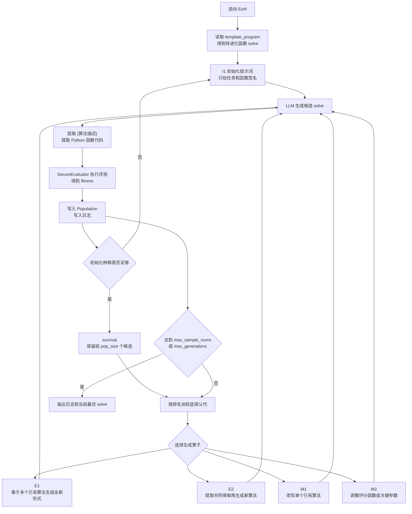
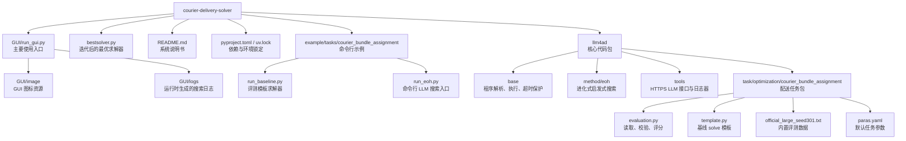
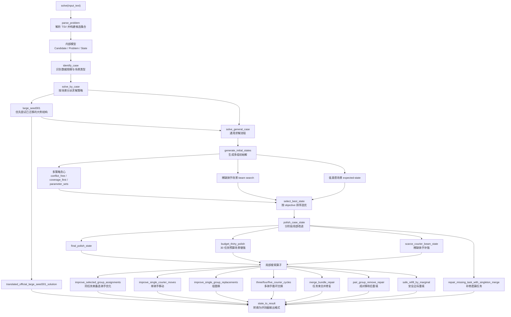

# 外卖配送求解系统说明书

这是一个用于外卖配送任务束分配的求解与评测系统。项目默认推荐通过 GUI 使用，同时保留命令行评测、最优求解器复现和 LLM 搜索入口。

具体题面、目标函数和合法性规则维护在 `llm4ad/task/optimization/courier_bundle_assignment/template.py` 与 `evaluation.py` 中；README 只说明系统如何安装、运行、扩展和验证。

## 系统能力

- 通过 GUI 配置 LLM、搜索方法和配送评测任务
- 运行 `solve(input_text)` 求解器并校验输出合法性
- 计算 objective 与 fitness，并在 GUI 中展示搜索过程
- 提供迭代后的最优求解器 `bestsolver.py`
- 提供命令行脚本用于快速评测和回归验证
- 使用 `uv` 管理 Python 环境与依赖锁文件

## 安装依赖

克隆仓库：

```bash
git clone https://github.com/tltltltltltltltl/courier-delivery-solver.git
cd courier-delivery-solver
```

安装 Python 依赖：

```bash
uv sync
```

项目依赖写在 `pyproject.toml`，主要包括：

- `numpy<2`
- `matplotlib`
- `ttkbootstrap`
- `pyyaml`
- `pytz`

GUI 使用 `tkinter`。macOS 和 Windows 的常见 Python 发行版通常自带 Tk；Linux 如果缺少 Tk，请先安装系统包，例如 Ubuntu/Debian：

```bash
sudo apt-get install python3-tk
```

## 主要使用方式：GUI

从仓库根目录启动：

```bash
uv run python GUI/run_gui.py
```

GUI 中的默认配置已经指向：

- Method: `eoh`
- Task: `courier_bundle_assignment`
- LLM class: `HttpsApi`

使用步骤：

1. 在左上角填写 LLM 的 `host`、`key`、`model`
2. 确认 Methods 中选中 `eoh`
3. 确认 Tasks 中选中 `courier_bundle_assignment`
4. 根据需要调整方法参数和任务参数
5. 点击 `Run`
6. 右侧会显示当前最优 objective 曲线和当前最优 `solve()` 代码
7. 运行日志会写入 `GUI/logs/`

## EoH 方法原理说明

EoH 是本系统默认保留的 LLM 搜索方法，全称可以理解为 Evolution of Heuristics。它不是直接让 LLM 给出一次答案，而是把 LLM 当作“启发式算法生成器”，不断生成、评测、筛选和改写 `solve()`，最后留下评分更好的求解器。

在本项目中，EoH 搜索的对象就是配送任务的 `solve(input_text)` 函数。评测器会把 LLM 生成的 `solve()` 放到配送数据上运行，校验输出是否合法，然后计算 fitness。由于系统内部使用 `fitness = -objective`，所以 EoH 会倾向保留 objective 更低的程序。

### 核心对象

- `template_program`：求解器模板，规定函数名、入参、返回格式和实现约束
- `task_description`：给 LLM 的任务说明，告诉它要优化什么
- `EoHPrompt`：把任务说明、已有算法和函数签名组装成提示词
- `EoHSampler`：调用 LLM，提取算法描述和 Python 函数代码
- `SecureEvaluator`：在受控评测环境中执行候选程序，防止单个坏程序拖垮主进程
- `Population`：保存当前种群，也就是当前若干个表现较好的候选 `solve()`
- `ProfilerBase`：记录每次采样、评分、当前最优程序和 GUI 曲线数据

### 搜索流程图



### 初始化阶段

EoH 首先使用 I1 提示词初始化种群。这个阶段不会给 LLM 任何已有算法，只提供：

- 配送任务说明
- `solve(input_text)` 函数签名
- 输出格式要求
- 代码必须自包含的约束

LLM 每生成一个候选 `solve()`，系统就立刻评测它。初始化阶段只接收合法且能得到 fitness 的程序。初始化最多尝试：

```text
min(max_sample_nums, 2 * pop_size)
```

如果初始化后可用程序少于 `selection_num`，搜索会停止，因为后续交叉和改写没有足够父代。

### 评测与注册

每个候选程序都会经过同一条评测链路：

1. `EoHSampler` 调用 LLM 得到文本回复
2. 从回复中提取 `{...}` 里的算法描述，作为该候选的自然语言说明
3. 从回复中提取 Python 函数代码
4. 将函数补回完整 `template_program`
5. `SecureEvaluator` 执行程序并调用 `CourierBundleAssignmentEvaluation`
6. 评测器校验任务冲突、骑手重复、未知 pair 等合法性
7. 合法则返回 `fitness = -objective`，非法则返回 `None`
8. `Population` 和 `ProfilerBase` 记录结果

初始化阶段遇到无效程序会直接丢弃。正式进化阶段中，无效程序会被赋为 `-inf`，不会成为优秀个体。

### 种群选择与生存

`Population` 中保存当前可用候选。每当新候选数量达到 `pop_size`，系统会执行一次 survival：

```text
当前种群 + 新候选 -> 按 fitness 降序排序 -> 保留前 pop_size 个
```

父代选择不是完全取第一名，而是按排名加权随机选择。排名越高，被选中的概率越大；排名靠后的候选仍有机会被选中。这能减少搜索过早收敛到单一写法。

当前实现中的权重近似为：

```text
weight(rank) = 1 / (rank + population_size)
```

### 四类进化算子

EoH 正式进化阶段会循环使用 E1、E2、M1、M2 四类提示词算子。

| 算子 | 输入 | 作用 |
| --- | --- | --- |
| `E1` | 多个已有算法 | 要求 LLM 创造一个形式明显不同的新算法 |
| `E2` | 多个已有算法 | 先总结共同骨架，再基于骨架生成新算法 |
| `M1` | 单个已有算法 | 在原算法基础上做结构性改写 |
| `M2` | 单个已有算法 | 识别主要参数或评分函数，并尝试新的参数设置 |

这四类算子对应几种常见的算法搜索动作：

- 探索：生成完全不同的新思路
- 继承：保留已有高分算法的有效骨架
- 变异：对单个算法做局部改造
- 调参：围绕评分函数、排序规则、阈值等细节做细粒度变化

### 并发执行

EoH 有两个并发层：

- `num_samplers`：同时向 LLM 请求多少个候选
- `num_evaluators`：同时评测多少个候选

评测执行器可以使用 thread 或 process。当前 GUI 默认使用线程模式，足够支撑配送任务的常规搜索；如果候选程序计算很重，可以在代码中把 `multi_thread_or_process_eval` 改为 `process`。

### 停止条件

搜索会在任一主要预算耗尽时停止：

- `max_sample_nums`：最多评测多少个候选程序
- `max_generations`：最多经历多少代种群更新

GUI 中右侧曲线展示的是采样过程中“当前最好 fitness”的变化。由于 fitness 是 objective 的相反数，曲线越高代表 objective 越低。

### 日志与结果

GUI 启动搜索后，会在 `GUI/logs/` 下创建一次运行目录。主要内容包括：

- `samples/`：每个候选程序、score、operator、完整 program
- `run_log.txt`：运行参数和日志
- GUI 右侧文本框：当前最优 `solve()` 代码

这些日志默认不提交到仓库，用于本地复盘和挑选更优求解器。当某个候选明显优于模板版本时，可以将它整理为独立文件，例如当前的 `bestsolver.py`。

### 在配送系统中的注意事项

- LLM 生成的 `solve()` 必须自包含，不能依赖 GUI、numpy 或项目内其它模块
- GUI 和框架可以安装第三方依赖，但被评测的求解器算法仍保持零依赖
- 任何输出都必须经过 `CourierBundleAssignmentEvaluation` 校验
- objective 变小才是真正变好，fitness 只是搜索内部使用的相反数

## 项目结构图



## 目录说明

```text
.
├── GUI/
│   ├── image/
│   └── run_gui.py
├── README.md
├── bestsolver.py
├── pyproject.toml
├── uv.lock
├── example/tasks/courier_bundle_assignment/
│   ├── run_baseline.py
│   └── run_eoh.py
└── llm4ad/
    ├── base/
    ├── gui.py
    ├── method/eoh/
    ├── tools/
    └── task/optimization/courier_bundle_assignment/
        ├── __init__.py
        ├── evaluation.py
        ├── official_large_seed301.txt
        ├── paras.yaml
        └── template.py
```

核心文件：

- `GUI/run_gui.py`：主要入口，启动图形界面
- `bestsolver.py`：迭代后的最优求解器，可直接导入其中的 `solve()`
- `llm4ad/gui.py`：GUI 调用后端评测和搜索的桥接层
- `llm4ad/task/optimization/courier_bundle_assignment/template.py`：基线求解器模板
- `llm4ad/task/optimization/courier_bundle_assignment/evaluation.py`：数据读取、输出校验和评分逻辑
- `llm4ad/task/optimization/courier_bundle_assignment/official_large_seed301.txt`：内置评测数据

## bestsolver 求解器结构图



## 命令行评测

评测基线模板：

```bash
uv run python example/tasks/courier_bundle_assignment/run_baseline.py
```

参考结果：

```text
case: CaseData(lines=33781, tasks=40, candidates=33780)
fitness: -930.2886616069427
objective: 930.2886616069427
```

评测迭代后的最优求解器：

```bash
uv run python - <<'PY'
from bestsolver import solve
from llm4ad.task.optimization.courier_bundle_assignment import CourierBundleAssignmentEvaluation

task = CourierBundleAssignmentEvaluation(timeout_seconds=10)
solution = solve(task.input_text)
objective = task.evaluate_solution(solution)
print("groups:", len(solution))
print("objective:", objective)
print("fitness:", -objective)
PY
```

参考结果：

```text
groups: 37
objective: 649.935226291243
fitness: -649.935226291243
```

## 求解器接口

系统只要求求解器实现一个函数：

```python
def solve(input_text: str) -> list:
    ...
```

返回格式：

```python
[(task_id_list_str, [courier_id, ...]), ...]
```

重要约束：

- `solve()` 内部算法保持零依赖，只使用 Python 标准库
- helper 函数、import 和辅助结构都放进 `solve()` 内部
- 不要依赖全局变量、外部类或模块级缓存
- 输出必须通过 `evaluation.py` 的合法性校验

工程环境安装的依赖供 GUI、框架侧、分析脚本或后续实验使用；这不改变 `solve()` 的零依赖要求。

## 更换评测数据

默认评测文件是：

```text
llm4ad/task/optimization/courier_bundle_assignment/official_large_seed301.txt
```

如需换数据，可以实例化评测器时传入文件路径：

```python
from llm4ad.task.optimization.courier_bundle_assignment import CourierBundleAssignmentEvaluation

task = CourierBundleAssignmentEvaluation(case_file="/path/to/case.tsv")
```

相对路径会按 `evaluation.py` 所在目录解析；绝对路径会直接读取。

## 命令行 LLM 搜索

GUI 是推荐入口；如果需要在命令行中启动搜索，可以编辑：

```text
example/tasks/courier_bundle_assignment/run_eoh.py
```

配置 LLM 接口：

```python
llm = HttpsApi(
    host="xxx",
    key="sk-xxx",
    model="xxx",
    timeout=60,
)
```

启动：

```bash
uv run python example/tasks/courier_bundle_assignment/run_eoh.py
```

## 验证命令

```bash
uv run python example/tasks/courier_bundle_assignment/run_baseline.py
uv run python -m compileall bestsolver.py llm4ad GUI example/tasks/courier_bundle_assignment
```

导入检查：

```bash
uv run python - <<'PY'
from llm4ad.method.eoh import EoH
from llm4ad.tools.llm import HttpsApi
from llm4ad.tools.profiler import ProfilerBase
from llm4ad.task import CourierBundleAssignmentEvaluation
print(EoH.__name__, HttpsApi.__name__, ProfilerBase.__name__, CourierBundleAssignmentEvaluation.__name__)
PY
```

## 开发建议

- 优先从 GUI 启动和观察搜索过程
- 修改 `template.py` 或 `bestsolver.py` 后先运行命令行评测
- 如果输出非法，评测器会打印失败原因
- 搜索日志默认写入 `GUI/logs/`，不纳入版本控制
